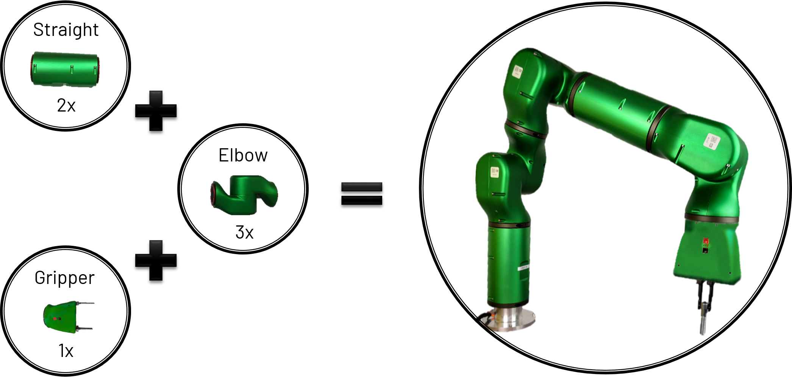

<!-- PROJECT SHIELDS -->
<!-- These badges can be used once we make the project public -->
<!-- [![Contributors][contributors-shield]][contributors-url]
[![Forks][forks-shield]][forks-url]
[![Stargazers][stars-shield]][stars-url]
[![Issues][issues-shield]][issues-url]
[![MIT License][license-shield]][license-url]
[![LinkedIn][linkedin-shield]][linkedin-url] -->

<!-- PROJECT LOGO -->
<br />
<p align="center">
  <a href="https://github.com/ADVRHumanoids/modular_hhcm">
    
  </a>

  <h2 align="center">modular</h2>

  <p align="center">
    Redefining flexible automation.
    <br />
    <a href="https://www.youtube.com/channel/UCNyqcpavE5nsVidipXZQ8OQ">View Demo</a>
    ·
    <a href="https://github.com/ADVRHumanoids/modular_hhcm/issues">Request Feature</a>
    ·
    <a href="https://github.com/ADVRHumanoids/modular_hhcm/issues">Report Bug</a>
    <br />
    <a href="#documentation"><strong>Explore the docs »</strong></a>
  </p>
</p>

[](https://app.travis-ci.com/ADVRHumanoids/modular)

<!--
[](https://codecov.io/gh/ADVRHumanoids/modular)
-->

<!-- TABLE OF CONTENTS -->
<details open="open">
  <summary>Table of Contents</summary>
  <ol>
    <li>
      <a href="#about-the-project">About The Project</a>
      <!-- <ul>
        <li><a href="#built-with">Built With</a></li>
      </ul> -->
    </li>
    <li><a href="#installation">Installation</a></li>
    <li><a href="#usage">Usage</a></li>
    <li><a href="#documentation">Docs</a></li>
    <li><a href="#roadmap">Roadmap</a></li>
    <li><a href="#contributing">Contributing</a></li>
    <!-- <li><a href="#license">License</a></li> -->
    <li><a href="#contact">Contact</a></li>
    <!-- <li><a href="#acknowledgements">Acknowledgements</a></li> -->
  </ol>
</details>

<!-- ABOUT THE PROJECT -->

## About The Project

This project focuses on the development of an app for rapid model generation of modular robots, starting from a set of basic robotic modules.
This app will genereate URDF, SRDF and a complete ROS package, which can be used to simulate and control the robot.



This is handled in 2 different scenarios: online or offline.

In the offline approach (Building Mode), a user sets up a robot with our reconfigurable modules in the virtual environment: the user selects modules from a library, assembles them to form a mechanism that is immediateley visualised in 3D.

An online approach (**Discovery Mode**) is also provided that allows the user to query the EtherCAT master for a description of the network topology graph. The  robot built from real physical modules is therefore recognized and displayed in 3D.

Moreover, a **Python API** to programmatically build a robot model from a Python script is also provided. Some example of [how to use the API](#use-the-python-api) are provided in the [scripts](https://github.com/ADVRHumanoids/modular_hhcm/tree/master/scripts) directory. For using the Python API install with [Option 1](#option-1-pip-install)

<!--
### Built With:

- [Python](https://nodejs.org/en/)
- [Travis-CI](https://travis-ci.com/)
- [ROS melodic]()
- [modular](https://github.com/ADVRHumanoids/modular/)
-->
<!-- - [CodeCov](https://about.codecov.io/) -->

<!-- GETTING STARTED -->

## Installation

Currently we only support Python3 (for the last version supporting Python2 see [v.0.0.4](https://github.com/ADVRHumanoids/modular/releases/tag/v0.0.4)) and it's recommended to have pip version 21.3 or newer if you plan use editable installs (see below).

There are 2 ways to install modular:

### Option 1. **pip install**

1. __Get the code__. Clone the repo using:
`git clone --recursive git@github.com:ADVRHumanoids/modular_hhcm.git`.
This will ensure the git submodule [modular_resources](git@github.com:ADVRHumanoids/modular_resources.git) is correctly initialized and cloned. (In alternative you can run `git submodule update --init --recursive` from the top directory after cloning)

2. __Install__. After cloning the repo, from the main directory run:
`pip install .`
The package can be installed in system, local, or virtualenv site-packages directory.
If you plan to make modifications it and don't want to re-install it every time, install it in 'editable mode' :
`pip install -e .`

### Option 2. **Use the binaries**
Get the `RobotBuilder` app from the latest release and make it executable (`chmod +x RobotBuilder`).

## Usage

### Configs

Several configurations can be modified for each deployment by creating a config file `src/modular/web/web_config.ini`. The most important ones are:

```ini
[MODULAR_API] # Mandatory section

# version of the API
version = 1

# When deploying the robot, return a zip file with the generated ROS package
download_on_deploy = true

# Use flash sessions to have multiple users on a single server
enable_sessions = true

# secret_key is used to sign the session cookie, it should be a random string
secret_key = FOO_BAR_BAZ

# base_route adds a prefix to all API routes, it is best to leave it commented
# base_route = /linfa/api/v${MODULAR_API:version}/modular
```

### Run the GUI
To use modular you need to start the python server.

1. If you installed with **pip install**:

```bash
python modular/src/modular/web/RobotDesignStudio.py
```
or even better, run:
```
robot-design-studio
```
Note: You might need to modify the PATH ;)

2. If you instead **use the binaries**:
run
```
./RobotBuilder
```

Then open <http://0.0.0.0:5000/> from a browser to acces the graphical interface.

### Use the python API
Examples of how to use the python API are provided in the [scripts](https://github.com/ADVRHumanoids/modular_hhcm/tree/master/scripts) folder.
- `create_modularbot.ipynb` shows an example of how to build a 6-DOF robot using Alberobotics modules and deploy URDF, SRDF, etc. into a ROS package
- `generate_concert_robot.ipynb` shows how to build and deploy the CONCERT modular robot

## Documentation

Static documentation for API calls has been added and is stored in the `modular/src/modular/web/docs` directory.
It can be accessed locally as follow:

1. clone the repo and navigate to the docs folder:

   ```bash
   git clone git@github.com:ADVRHumanoids/modular.git
   cd modular/src/modular/web/docs
   ```

2. start a local python HTTP server:

   ```bash
   python -m http.server
   ```

3. open <http://0.0.0.0:8000/> from a browser

<!-- ROADMAP -->

## Roadmap

See the [open issues](https://github.com/ADVRHumanoids/modular_hhcm/issues) for a list of proposed features (and known issues).

<!--See the [Roadmap kanban](https://github.com/ADVRHumanoids/modular_hhcm/projects/1) for the state of the development. -->

<!-- CONTRIBUTING -->

## Contributing

Contributions are what make the open source community such an amazing place to learn, inspire, and create. Any contributions you make are **greatly appreciated**.

1. Fork the Project
2. Create your Feature Branch (`git checkout -b feature/AmazingFeature`)
3. Commit your Changes (`git commit -m 'Add some AmazingFeature'`)
4. Push to the Branch (`git push origin feature/AmazingFeature`)
5. Open a Pull Request

<!-- TODO:LICENSE - ->
## License

Distributed under the MIT License. See `LICENSE` for more information. -->

<!-- CONTACT -->

## Contact

Alberobotics team - alberobotics@iit.it

Project Link: [https://github.com/ADVRHumanoids/modular_hhcm](https://github.com/ADVRHumanoids/modular_hhcm)

<!-- ACKNOWLEDGEMENTS - ->
## Acknowledgements -->

<!-- MARKDOWN LINKS & IMAGES -->
<!-- These will be used once we make the project public -->
<!-- https://www.markdownguide.org/basic-syntax/#reference-style-links - ->

[contributors-shield]: https://img.shields.io/github/contributors/ADVRHumanoids/modular.svg?style=for-the-badge
[contributors-url]: https://github.com/ADVRHumanoids/modular/graphs/contributors
[forks-shield]: https://img.shields.io/github/forks/ADVRHumanoids/modular.svg?style=for-the-badge
[forks-url]: https://github.com/ADVRHumanoids/modular/network/members
[stars-shield]: https://img.shields.io/github/stars/ADVRHumanoids/modular.svg?style=for-the-badge
[stars-url]: https://github.com/ADVRHumanoids/modular/stargazers
[issues-shield]: https://img.shields.io/github/issues/ADVRHumanoids/modular.svg?style=for-the-badge
[issues-url]: https://github.com/ADVRHumanoids/modular/issues
[license-shield]: https://img.shields.io/github/license/ADVRHumanoids/modular.svg?style=for-the-badge
[license-url]: https://github.com/ADVRHumanoids/modular/blob/master/LICENSE.txt
[linkedin-shield]: https://img.shields.io/badge/-LinkedIn-black.svg?style=for-the-badge&logo=linkedin&colorB=555
[linkedin-url]: https://linkedin.com/in/othneildrew
[product-screenshot]: images/screenshot.png -->
